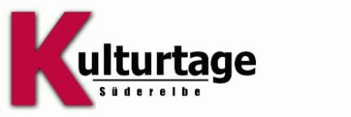
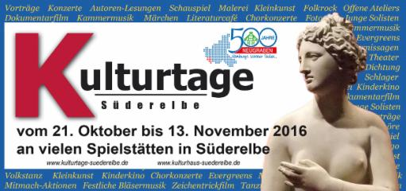

# Kulturtage Süderelbe 2017

Seit sieben Jahren führt unser Kulturhaus Süderelbe als Koordinator und
Organisator die vielen kulturellen Einzelveranstaltungen im Süerelberaum
im Rahmen der Kulturtage zu einem beeindruckenden Ganzen zusammen.

Die "Kulturtage Süderelbe 2017“ finden 
**von Fr, den 3. Nov. bis So, den 19. Nov. 17** 
statt, diesmal eine Dauer von rund zwei Wochen.

Mit den Kulturtagen möchten wir zusammen mit Ihnen einen Querschnitt des
vielfältigen kulturellen Lebens in unserer Region zeigen und ein
Programm gestalten, das in diesem Zeitraum Kultur in Süderelbe
widerspiegelt und viele Besucher anzieht. Ihren Programmbeitrag, sowohl
als erfahrener lokaler Kulturveranstalter als auch als Amateur, nehmen
wir gerne im Kulturtage- Programmflyer, der dann von uns intensiv
beworben wird, auf.

Meldungen zu Beiträgen sind bereits jetzt, unter
<info@kulturhaus-suederelbe.de> sehr willkommen!

Unterstützen Sie uns und machen Sie mit! Ob Lesung, Konzert,
Ausstellung, Performance, Theaterstück oder Tanzveranstaltung - bringen
Sie Ihre Veranstaltung auf die „Bühne“ der Kulturtage!

[Das Kulturtage-Programm 2016 finden Sie hier zur
Ansicht](resources/Flyer+Kulturtage_011116.pdf)

„Kulturtage Süderelbe 2016“ zeigten wieder, wie vielfältig das
kulturelle Angebot in unserer Region ist! Allen Mitwirkenden sagen wir
ein riesiges Dankeschön!

